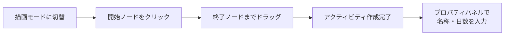

# アクティビティの追加

ネットワーク工程表にイベントノードとアクティビティ（作業）を追加する方法を説明します。

## イベントノードの追加

1. ツールバーで**描画モード**に切り替えます
2. キャンバス上の任意の位置をクリックします
3. イベントノード（○）が作成され、自動的に番号が割り当てられます

## アクティビティの追加

1. **描画モード**で、開始イベントノードをクリックしたまま終了イベントノードまでドラッグします
2. 矢印（アクティビティ）が作成されます
3. 新しいノードを終点にする場合は、空いている場所までドラッグすると自動で新しいイベントノードが作成されます

:::tip ノードの自動マージ
イベントノードを別のノードの上にドラッグすると、自動的にマージされます。これにより、既存のノードへの接続が簡単にできます。
:::

## プロパティパネル

アクティビティを選択すると、右側のプロパティパネルで詳細を編集できます：

### 基本設定

| プロパティ | 説明 |
|-----------|------|
| 作業名 | アクティビティの名称（複数行入力可） |
| 所要日数 | 作業に必要な日数 |
| ダミー | チェックすると点線表示、所要日数0日 |
| 日数表示 | 工程表上に日数を表示するか |

### 工期計算モード

所要日数の入力には2つのモードがあります：

#### 手動入力
日数を直接入力します。

#### 歩掛計算

数量・人工・歩掛から日数を自動計算します：

**計算式**: `所要日数 = 数量 ÷ (人工 × 歩掛)`

| 項目 | 説明 |
|------|------|
| 数量 | 作業の数量（単位付き） |
| 人工（にんく） | 投入する人員数 |
| 歩掛（ぶがかり） | 1人1日あたりの施工量 |

#### 歩掛マスタ選択

歩掛フィールドの横にある **[…]** ボタンをクリックすると、**歩掛マスタ選択ポップアップ**が表示されます。公共建築工事標準仕様書に基づく歩掛データベースから選択できます。

**3カラム構成：**

1. **工種カテゴリ** — 左カラムに工種一覧が表示されます。CSVデータがない工種はグレーアウトされます
2. **細目** — カテゴリを選択すると、中央カラムに細目一覧が表示されます
3. **歩掛・単位** — 細目を選択すると、右カラムに歩掛値と単位が表示されます

選択すると、歩掛・数量単位がプロパティパネルに自動セットされ、工期が再計算されます。

:::tip 土建コード設定
ツールバーの歩掛設定（⚙️）から、使用する土建コード（土木・建築・住宅・造園・ダム）を選択できます。選択したコードに応じて、歩掛マスタのカテゴリがフィルタリングされます。
:::

:::info 歩掛計算による後続パスへの自動伝播
歩掛を変更して工期が変わると、後続の全パスの位置が自動的に調整されます。工期が延びた場合は後続パスが後ろにずれ、工期が縮んだ場合は前に詰まります。
:::

### 表示設定（詳細設定）

| 項目 | 説明 |
|------|------|
| 線の種類 | 実線/破線/点線 |
| 線の色 | カラーピッカーで選択 |
| 線の太さ | 0.1〜10px（+/−ボタンで調整） |
| テキスト配置 | 左寄せ/中央/右寄せ |
| 引出線スタイル | 線/下線 |
| 経路設定 | 折れ曲がり回数（0/1/2回）、方向（水平/垂直/直線） |
| ラベル位置 | オフセット調整（リセット可） |
| 備考 | メモ欄 |
