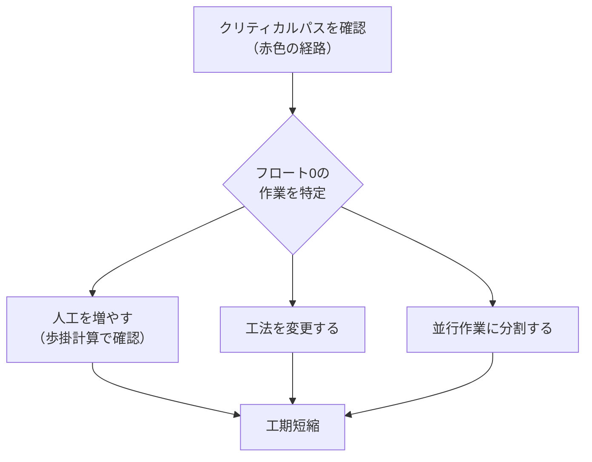

# クリティカルパスの確認

クリティカルパスの確認方法と活用方法を説明します。

## クリティカルパスとは

プロジェクト全体の工期を決定する最長経路のことです。クリティカルパス上の作業はフロート（余裕日数）が0であり、遅れるとプロジェクト全体の工期が遅れます。

## 自動計算と表示

Con-Scheでは、アクティビティと依存関係を設定すると**自動的にCPM計算が実行**され、クリティカルパスが**赤色で強調表示**されます。手動で計算する必要はありません。

## イベントノードの確認

イベントノード（結合点）を選択すると、プロパティパネルに以下が表示されます：

| 項目 | 説明 |
|------|------|
| ノード番号 | イベントノードの識別番号 |
| ラベル | ノードに付けた名称（任意） |
| ET（最早結合点時刻） | 最も早くこのノードに到達できる時刻 |
| LT（最遅結合点時刻） | 工期を遅らせずに到達できる最も遅い時刻 |
| スラック | LT − ET。0ならクリティカルパス上 |

## アクティビティのCPM結果

アクティビティを選択すると、プロパティパネルに以下の計算結果が表示されます：

| 項目 | 説明 |
|------|------|
| ES（最早開始時刻） | 最も早く作業を開始できる時刻 |
| EF（最早完了時刻） | 最も早く作業が完了する時刻 |
| LS（最遅開始時刻） | 工期を遅らせずに開始できる最も遅い時刻 |
| LF（最遅完了時刻） | 工期を遅らせずに完了できる最も遅い時刻 |
| TF（トータルフロート） | 後続作業に影響なく遅らせられる日数 |
| FF（フリーフロート） | 直後の作業に影響なく遅らせられる日数 |
| クリティカルパス | このアクティビティがクリティカルパス上かどうか |

## 工期短縮の検討

クリティカルパス上の作業の所要日数を短縮することで、プロジェクト全体の工期を短縮できます。フロートがある作業の日数を短縮しても全体工期には影響しません。

:::tip フロートの活用
トータルフロートが大きい作業は、資源（人員・機材）をクリティカルパス上の作業に振り替える余地があります。歩掛計算モードを使えば、人工の増減による工期への影響をすぐに確認できます。
:::
